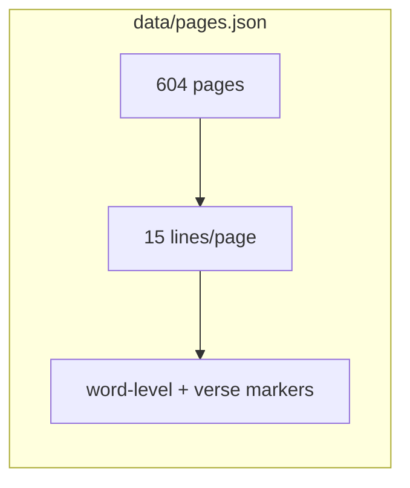
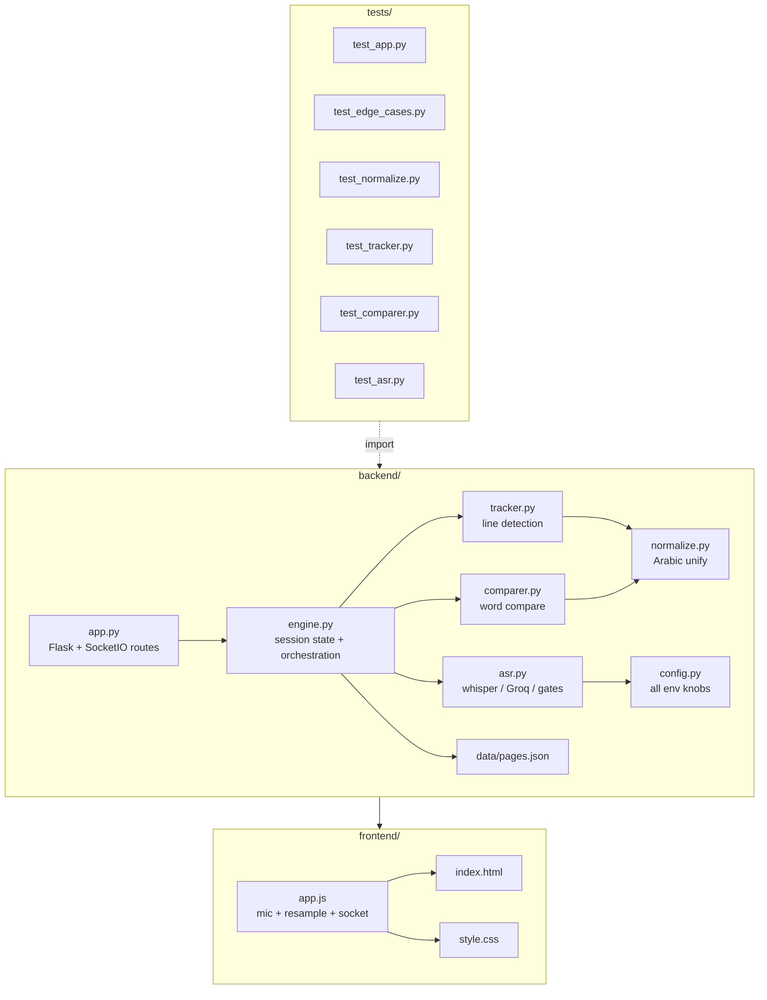
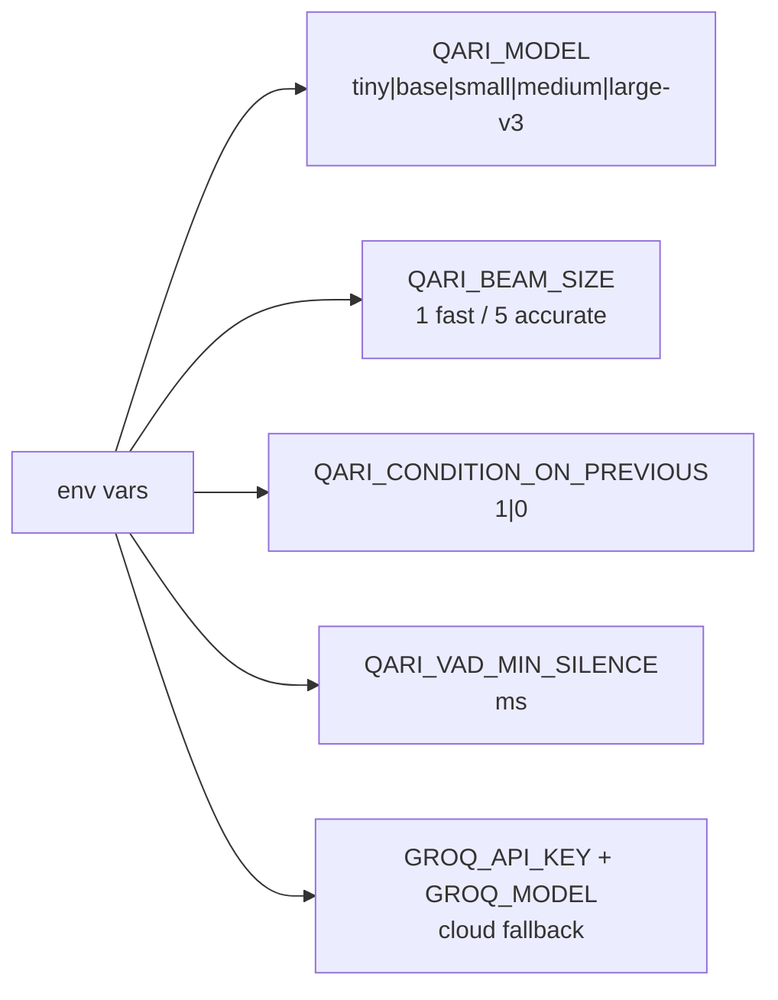
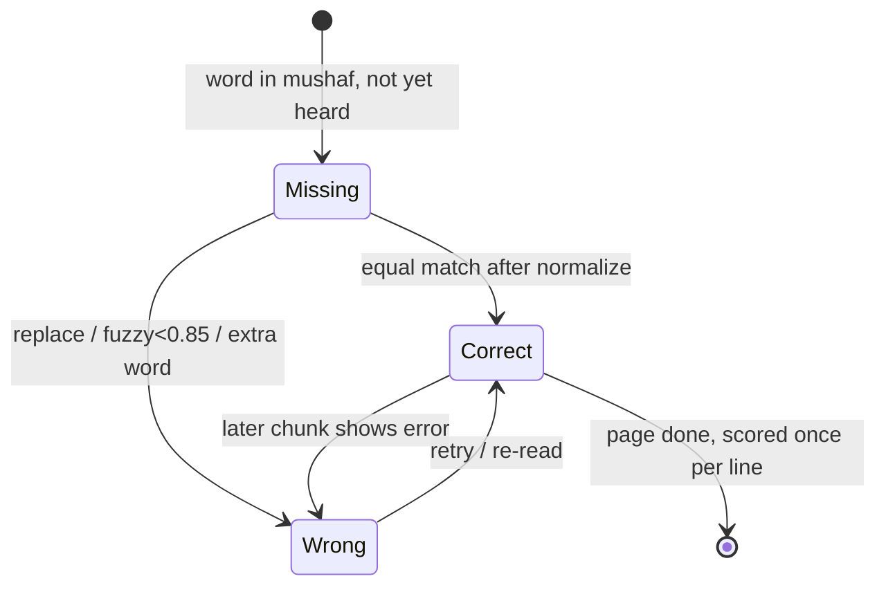
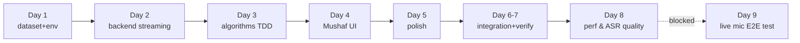
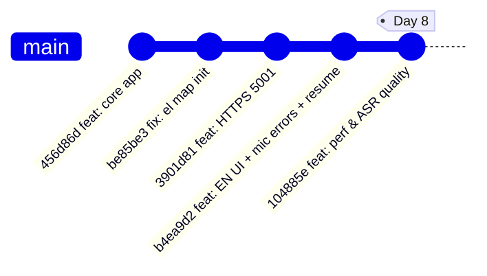

# WHAT IS GOING ON — Qari session tracker

Live log of every session. Read this first each session to know state.
Project: **AI Quran Recitation Visual Feedback System** (git repo: /home/mbi/qari, branch main).

---

## CURRENT STATE (Day 8 — complete)

- All core features DONE. 47 pytest tests pass.
- Committed: `104885e` on main.
- Server: `./run.sh` → http://localhost:5000 + https://localhost:5001 (self-signed, for mic).
- Live mic E2E still UNTESTED on real hardware — user had no microphone. Human test needed.

## GRAPH — pipeline & data flow

```mermaid
flowchart LR
  Mic -->|ScriptProcessor 48k| Resample["resampleTo16k<br/>FIR low-pass"]
  Resample -->|RMS gate: drop silence| Pending["pending buffer 2.5s"]
  Pending -->|audio_chunk base64 PCM| Socket[SocketIO]
  Socket --> Gate["_is_silence RMS gate"]
  Gate -->|silent| Out0["'' empty feedback"]
  Gate -->|speech| Whisper["faster-whisper small int8<br/>beam=1, VAD, no timestamps"]
  Line["current+next line<br/>initial_prompt"] -.context.-> Whisper
  Whisper --> Normalize["normalize.py<br/>strip harakat, unify letters"]
  Normalize --> Tracker["tracker.py<br/>SequenceMatcher, 5-line window"]
  Tracker --> Compare["comparer.py<br/>word edit-distance"]
  Compare --> Feedback["feedback emit:<br/>line_no + word statuses"]
  Feedback --> UI["Mushaf UI<br/>green active line, red wrong,<br/>orange missing, accuracy"]
```

## GRAPH — module dependency map

## GRAPH — config knobs (config.env)

## GRAPH — word status state machine

## GRAPH — per-session dependency chain

## GRAPH — sessions & history

## SESSION LOG (Day 1..8)

| Day | What happened |
|-----|---------------|
| 1 | Dataset + env: Tanzil Uthmani text, Madani 15-line layout, built `data/pages.json` (604p), venv, faster-whisper small int8 verified |
| 2 | Backend: Flask + SocketIO streaming, ASR wrapper (local + Groq fallback), /transcribe, PCM handling |
| 3 | Algorithms TDD: `normalize.py`, `tracker.py`, `comparer.py` (26 tests). Caught+fixed insert/delete swap bug |
| 4 | Frontend Mushaf UI: 15-line grid, Amiri font, mic capture, live line/word feedback |
| 5 | Polish: transitions, auto-scroll, completion banner, page nav. KEY: match lines by mushaf `line_no`, not engine idx |
| 6-7 | Integration: latency ~0.9s/chunk OK, Groq toggle, edge cases, E2E via systemd, 37 tests, README |
| 8 | Perf & ASR quality: silence gates (0.3ms vs 0.9s), anti-aliasing resampler (client+server), ASR knobs, lookahead prompt, 10 new tests (47 total) |

## WHAT I KNOW / GOTCHAS

- Run tests: `.venv/bin/python -m pytest tests -q` (plain `pytest` fails — `backend` not on path).
- Line index in engine (text-only) ≠ 15-slot UI index → always match by `line_no` (mushaf number).
- Browser mic requires secure origin: use https://localhost:5001, never LAN IP.
- Socket.io CDN 4.7.5 fixed a version-mismatch bug.
- ScriptProcessorNode deprecated but works; alternative AudioWorklet if rework needed.
- faster-whisper `transcribe` needs numpy array, not raw bytes (asr.pcm16_to_f32).
- Whisper is not thread-safe → global `_LOCK` serializes transcribe in engine.py.
- Server on this machine: run via `systemd-run --user --unit=qari` (bash-tool kills plain bg procs).
- Model cached locally (~460MB small int8). Warmup thread on startup.

## NEXT STEPS (blocked: mic)

1. User gets mic → run server, open https://localhost:5001, allow mic, recite page.
2. Verify live: active line green follows recitation, wrong red, missing orange, accuracy, completion banner.
3. If recognition off for user voice → tune comparer thresholds or set `QARI_BEAM_SIZE=5`.
4. If too slow → GROQ_API_KEY in config.env.

## KEY FILES

- `backend/app.py` Flask+SocketIO server (HTTP 5000 + HTTPS 5001)
- `backend/engine.py` transcribe→track→compare orchestration
- `backend/asr.py` whisper local / Groq fallback, silence gate, resampler
- `backend/config.py` all knobs (env: QARI_MODEL, QARI_BEAM_SIZE, GROQ_*, ...)
- `backend/normalize.py` / `tracker.py` / `comparer.py` comparison engine
- `frontend/` Mushaf UI (vanilla JS), `frontend/app.js` mic + resample + socket
- `data/pages.json` 604p × 15 lines
- `tests/` 47 tests
- `TASK.md` task log, `RESUME.txt` quick resume, `certs/` self-signed (gitignored)
